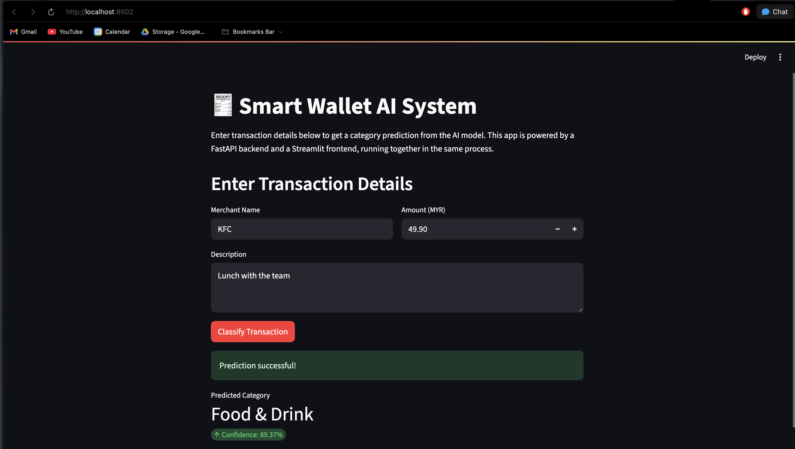
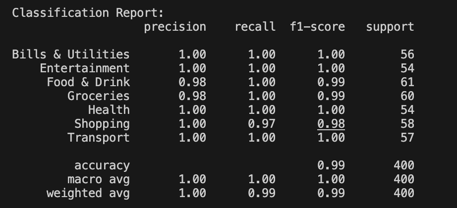

# 🤖 Smart Wallet AI Transaction Classifier

This project is a complete, end-to-end AI system designed to automatically classify financial transactions into categories such as `Food & Drink`, `Shopping`, and `Transport`. It features a machine learning backend with multiple specialist models, a smart tagging system, and a live, interactive web interface.

---

## 📋 Table of Contents
1. [Features](#-features)
2. [Live Demo](#-live-demo)
3. [Tech Stack](#-tech-stack)
4. [Project Structure](#-project-structure)
5. [Setup and Local Usage](#️-setup-and-local-usage)
6. [Dataset Summary](#-dataset-summary)
7. [Model Training & Evaluation](#-model-training--evaluation)
8. [Scalability Reflection](#-scalability-reflection)

---

## ✨ Features

* **AI-Powered Classification:** Uses three distinct `scikit-learn` models to accurately predict categories from either combined, merchant-only, or description-only data.
* **Smart Tagging:** Automatically extracts keywords like brands and locations (e.g., "Uniqlo", "Starbucks") using `spaCy`'s Named Entity Recognition.
* **Flexible API:** A robust API built with `FastAPI` that intelligently selects the best model based on the input provided.
* **Interactive UI:** A simple and clean user interface built with `Streamlit` for easy, real-time classification.
* **Containerized Deployment:** Fully containerized with `Docker` and deployed on Hugging Face Spaces for public access.

---

## 🔗 Live Demo

You can test the live application here:
**https://huggingface.co/spaces/bchoows/smart-wallet-ai**



---

## 🛠️ Tech Stack

* **Backend:** Python, FastAPI, Uvicorn
* **Frontend:** Streamlit
* **ML / NLP:** Scikit-learn, Pandas, spaCy, Joblib
* **Data Generation:** Faker
* **Deployment:** Docker, Hugging Face Spaces

---

## 📁 Project Structure

A brief overview of the key files in this project:
* generate_data.py          - Script to create the mock transaction dataset.
* train.py                  - Script to train and save all three ML models.
* main.py                   - The FastAPI backend server for serving models.
* app.py                    - The Streamlit frontend for the user interface.
* requirements.txt          - Dependencies for the main application.
* Dockerfile                - Configuration for containerized deployment.
* transaction_classifier_*.joblib      - Saved machine learning models.
* mock_transactions.csv     - The generated dataset.

---

## ⚙️ Setup and Local Usage

Follow these steps to run the project on your machine.

### Part 1: Generate the Dataset (mock_data_generator folder)
This step is a prerequisite for training the models. The necessary libraries are `pandas` and `faker`.

1.  **Install data generation libraries:**
    ```bash
    pip install -r data_requirements.txt
    ```
2.  **Run the script:**
    ```bash
    python generate_data.py
    ```
    This will create the `mock_transactions.csv` file needed for the next steps.

3.  **Train the data:**
    ```bash
    python train.py
    ```
    This will create the 3 `transaction_classifier_*.joblib` files needed for the next steps. Move the 3 .joblib files to the main folder with the main.py and app.py files.

### Part 2: Run the Application
This will set up the environment to train the models and run the web app.

1.  **Clone the repository:**
    ```bash
    git clone https://github.com/bchoows/smart-wallet-ai.git
    cd smart-wallet-ai
    ```
2.  **Create and activate a virtual environment with Python 3.11:**
    ```bash
    python -m venv venv
    source venv/bin/activate
    ```
3.  **Install all application dependencies:**
    ```bash
    pip install -r requirements.txt
    ```
4.  **(Optional) Train the models:**
    If you want to train the models yourself, run the training script:
    ```bash
    python train.py
    ```
5.  **Run the API Server:**
    Open a terminal and run the backend:
    ```bash
    uvicorn main:app --reload
    ```
6.  **Run the User Interface:**
    Open a **second terminal** and run Streamlit:
    ```bash
    streamlit run app.py
    ```

---

## 📝 Dataset Summary

The models were trained on a mock dataset of 2000 transactions, generated by the `generate_data.py` script. The dataset includes `amount`, `merchant`, `timestamp`, `description`, and `category` fields. Categories were predefined to simulate common real-world spending patterns.

---

## 📊 Model Training & Evaluation

The models were trained using a Logistic Regression classifier. The primary `combined` model achieved an overall accuracy of **99%** on the unseen test set.

**Classification Report (Combined Model):**


---

## 💡 Scalability Reflection

To scale this system for multiple users or banks, I would consider the following improvements:

* **Database Integration:** Replace the CSV file with a scalable database like PostgreSQL to handle millions of transactions and user data efficiently.
* **Robust Data Ingestion:** Build a dedicated data pipeline to handle and normalize transaction data from different banks, each with its own unique format.
* **Asynchronous Processing:** Use a message queue like RabbitMQ or Kafka for transaction processing. This would allow the API to respond instantly to user requests while classification happens in the background.
* **Personalization:** Introduce user-specific models by fine-tuning a base model on each user's spending habits using transfer learning.
* **CI/CD for Retraining:** Implement a CI/CD pipeline to automatically retrain and deploy the models as new labeled data becomes available, ensuring the AI stays up-to-date.
* **Dedicated Infrastructure:** Move from a single-container deployment to a microservices architecture orchestrated by Kubernetes on a cloud provider (AWS, GCP, Azure) for better scalability and fault tolerance.